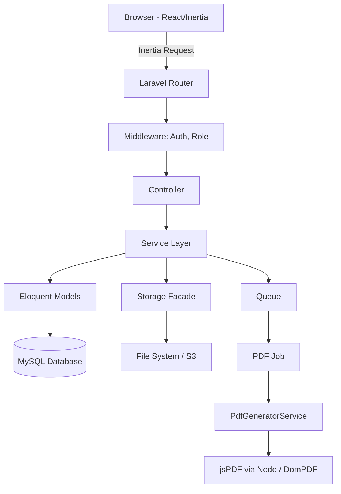
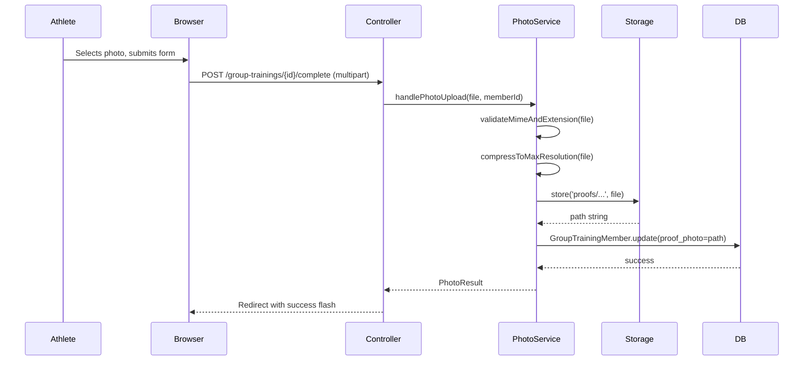
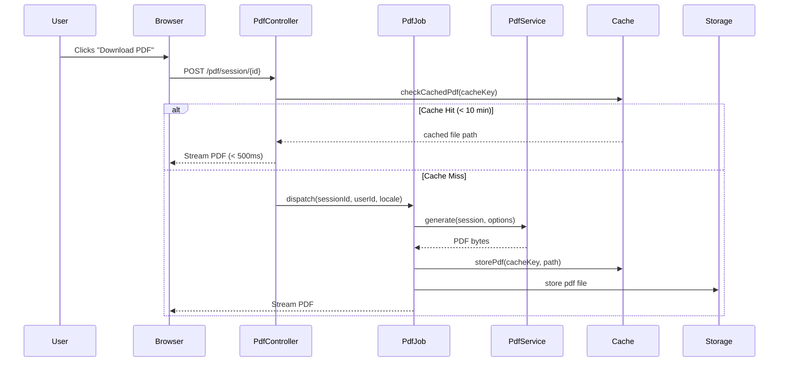
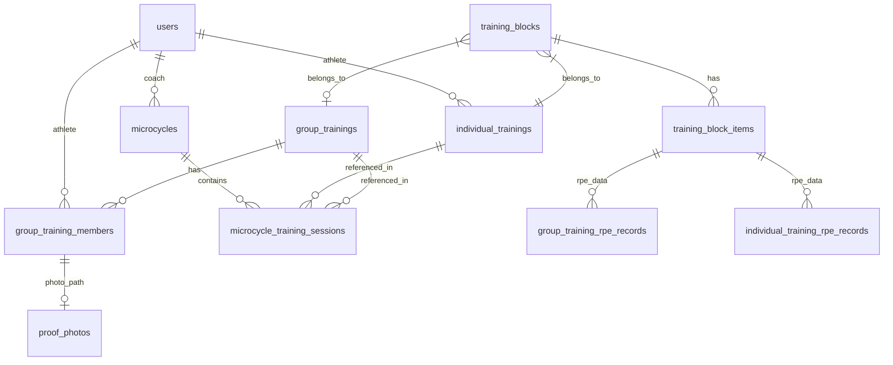

# Design Document: Training System Improvements

## Overview

This document describes the technical design for a set of improvements to the Athlete Performance Tracking System — a Laravel 12 + Inertia.js + React application. The improvements address four primary areas:

1. **Photo evidence storage fix** — group training photo uploads not persisting correctly
2. **PDF export system** — per-session and microcycle batch PDF exports using jsPDF
3. **Session recap interface** — enhanced post-session summary page with PDF download
4. **UI/UX consistency** — Shadcn-aligned Tailwind theme, dark mode, multi-language completeness

The system uses Laravel 12 on the backend with Inertia.js as the SPA bridge and React 18 on the frontend. Styling is Tailwind CSS v3. File storage uses Laravel's `Storage` facade with the `public` disk. Queue system uses Laravel Jobs for async processing. Translations use Laravel's `lang/` directory with PHP array files.

---

## Architecture

### High-Level Request Flow



### Component Interaction: Photo Upload



### Component Interaction: PDF Generation



---

## Components and Interfaces

### Backend Services

#### `PhotoUploadService`

Responsible for validating, compressing, and storing photo evidence files.

```php
class PhotoUploadService
{
    /**
     * Validates format (JPEG/PNG/WEBP) using both MIME and extension.
     * Compresses to max 1920x1080 at quality >= 85.
     * Stores to 'proofs/{athleteId}/{filename}' on the public disk.
     *
     * @throws PhotoValidationException
     * @throws PhotoStorageException
     */
    public function store(UploadedFile $file, int $athleteId): string;

    /**
     * Deletes a stored photo and clears any DB reference.
     */
    public function delete(string $path, GroupTrainingMember $member): void;
}
```

#### `PdfGeneratorService`

Generates PDFs using DomPDF (server-side) for A4 portrait format with consistent branding.

```php
class PdfGeneratorService
{
    /**
     * Generates a single-session PDF.
     * Returns PDF byte string or throws PdfGenerationException.
     */
    public function generateSessionPdf(
        IndividualTraining|GroupTraining $session,
        User $requestingUser,
        string $locale = 'id'
    ): string;

    /**
     * Generates a microcycle consolidated PDF.
     */
    public function generateMicyclePdf(
        Microcycle $microcycle,
        User $requestingUser,
        string $locale = 'id'
    ): string;

    /**
     * Returns true if the generation is expected to exceed 10 seconds
     * (based on session count, photo count, etc.) and should be async.
     */
    public function requiresAsync(int $sessionCount, int $photoCount): bool;
}
```

#### `MicrocycleService`

Manages grouping of training sessions into microcycles.

```php
class MicrocycleService
{
    public function createMicrocycle(array $data, User $coach): Microcycle;
    public function attachSession(Microcycle $microcycle, int $sessionId): void;
    public function detachSession(Microcycle $microcycle, int $sessionId): void;
    public function getAggregateMetrics(Microcycle $microcycle): array;
    // Returns: ['total_load' => float, 'avg_rpe' => float, 'session_count' => int]
}
```

#### `LocaleService`

Handles locale resolution and translation key completeness validation.

```php
class LocaleService
{
    /** Returns the user's stored locale preference (id|en|pt). */
    public function getUserLocale(User $user): string;

    /** Updates the user's stored locale without page reload via Inertia shared props. */
    public function updateUserLocale(User $user, string $locale): void;

    /** Returns formatted date string per locale. */
    public function formatDate(Carbon $date, string $locale): string;

    /** Returns formatted number per locale. */
    public function formatNumber(float $number, string $locale, int $decimals = 2): string;
}
```

### Background Jobs

#### `GeneratePdfJob`

```php
class GeneratePdfJob implements ShouldQueue
{
    public int $tries = 3;
    public int $timeout = 120;

    public function __construct(
        public readonly string $pdfType,   // 'session' | 'microcycle'
        public readonly int $resourceId,
        public readonly int $requestingUserId,
        public readonly string $locale,
        public readonly string $notificationChannel
    ) {}

    public function handle(PdfGeneratorService $generator): void;
    public function failed(\Throwable $e): void; // Notifies user of failure
}
```

#### `RetryPhotoUploadJob`

Queued when the filesystem is unavailable, retries up to 3 times with exponential backoff.

```php
class RetryPhotoUploadJob implements ShouldQueue
{
    public int $tries = 3;
    public int $backoff = 60; // seconds

    public function __construct(
        public readonly string $tempPath,
        public readonly int $memberId
    ) {}
}
```

### Frontend Components

#### `SessionRecap` (React)

Route: `Admin/GroupTrainings/SessionRecap.jsx` and `Admin/IndividualTrainings/SessionRecap.jsx`

Props:
- `session` — training session data (blocks, items, RPE records)
- `member` — for group training, the athlete's member record (includes `proof_photo`)
- `canDownloadPdf` — boolean, true for coaches and session owner athletes
- `locale` — current user locale

Renders:
- Summary header (date, location, trainer)
- Block/exercise table with sets, reps, load, RPE
- Photo thumbnails (lazy-loaded) if `proof_photo` exists
- PDF download button (when `canDownloadPdf` is true)

#### `PdfDownloadButton` (React)

Shared component that calls the PDF export endpoint.

```jsx
<PdfDownloadButton
  endpoint="/pdf/session/42"
  filename="session-42.pdf"
  label={t('pdf.download')}
/>
```

Handles loading state, error display, and opens PDF in a new tab or triggers download.

#### `MicycleManager` (React)

Provides UI to:
- Create/name a microcycle
- Assign existing sessions to it
- Request batch PDF export
- View aggregate metrics

#### `ThemeProvider` (React)

Wraps the application and exposes `useTheme()` hook for dark/light mode. Reads from `localStorage` and syncs with `data-theme` attribute on `<html>`.

---

## Data Models

### New Table: `microcycles`

```sql
CREATE TABLE microcycles (
    id          BIGINT UNSIGNED AUTO_INCREMENT PRIMARY KEY,
    coach_id    BIGINT UNSIGNED NOT NULL,
    name        VARCHAR(255) NOT NULL,
    start_date  DATE NOT NULL,
    end_date    DATE NOT NULL,
    notes       TEXT NULL,
    created_at  TIMESTAMP NULL,
    updated_at  TIMESTAMP NULL,
    FOREIGN KEY (coach_id) REFERENCES users(id) ON DELETE CASCADE
);
```

### New Table: `microcycle_training_sessions`

Pivot table linking microcycles to both individual and group training sessions.

```sql
CREATE TABLE microcycle_training_sessions (
    id                      BIGINT UNSIGNED AUTO_INCREMENT PRIMARY KEY,
    microcycle_id           BIGINT UNSIGNED NOT NULL,
    individual_training_id  BIGINT UNSIGNED NULL,
    group_training_id       BIGINT UNSIGNED NULL,
    sort_order              INT DEFAULT 0,
    FOREIGN KEY (microcycle_id) REFERENCES microcycles(id) ON DELETE CASCADE,
    FOREIGN KEY (individual_training_id) REFERENCES individual_trainings(id) ON DELETE RESTRICT,
    FOREIGN KEY (group_training_id) REFERENCES group_trainings(id) ON DELETE RESTRICT
);
```

The `ON DELETE RESTRICT` foreign key on individual_training_id and group_training_id enforces Requirement 10.4 — sessions referenced in microcycles cannot be deleted.

### Modified Table: `group_training_members`

The column `proof_photo` already exists (from migration `2026_07_03_104503`). The current issue is that the controller's file storage logic is present but the frontend form may not be correctly submitting the file as multipart. No schema changes required — only the service extraction and validation hardening.

### Modified Table: `users`

Add `language_preference` column:

```sql
ALTER TABLE users ADD COLUMN language_preference VARCHAR(10) NOT NULL DEFAULT 'id';
```

### New Table: `pdf_cache`

Tracks generated PDFs to support cache retrieval within 10-minute window.

```sql
CREATE TABLE pdf_cache (
    id          BIGINT UNSIGNED AUTO_INCREMENT PRIMARY KEY,
    cache_key   VARCHAR(255) NOT NULL UNIQUE,
    file_path   VARCHAR(500) NOT NULL,
    expires_at  TIMESTAMP NOT NULL,
    created_at  TIMESTAMP NULL,
    INDEX idx_cache_key (cache_key),
    INDEX idx_expires_at (expires_at)
);
```

### Eloquent Model Relationships Summary



---

## API Design

### Photo Upload (Fix)

The existing endpoint is `POST /athlete/group-trainings/{training}/complete`. The fix involves:

1. Extracting file handling into `PhotoUploadService`
2. Adding both MIME and extension validation
3. Adding image compression before storage
4. Handling concurrent uploads via database-level upsert (`updateOrCreate`)

### PDF Export Endpoints

```
POST /pdf/session/{training}
    Body: { type: 'individual'|'group', locale: 'id'|'en'|'pt' }
    Response: PDF stream or { job_id: string } if async

POST /pdf/microcycle/{microcycle}
    Body: { locale: 'id'|'en'|'pt' }
    Response: PDF stream or { job_id: string } if async

GET /pdf/status/{job_id}
    Response: { status: 'pending'|'ready'|'failed', download_url?: string }
```

### Microcycle Endpoints

```
GET    /admin/microcycles
POST   /admin/microcycles
GET    /admin/microcycles/{id}
PUT    /admin/microcycles/{id}
DELETE /admin/microcycles/{id}
POST   /admin/microcycles/{id}/sessions
DELETE /admin/microcycles/{id}/sessions/{sessionId}
```

### Language Preference Endpoint

```
PATCH /user/language
    Body: { locale: 'id'|'en'|'pt' }
    Response: { locale: 'id' } + Inertia shared props refresh
```

---

## Implementation Approach

### Requirement 1: Photo Evidence Fix

The root cause is likely that the frontend Inertia form is not submitting with `forceFormData: true`, causing the file to be stripped. The fix:

1. In the `SessionRecap` / completion form, ensure `useForm` uses `forceFormData: true` when a file is included.
2. Extract photo handling from `GroupTrainingController::completeTraining` into `PhotoUploadService`.
3. Add MIME + extension validation (JPEG, PNG, WEBP).
4. Add image compression using the `Intervention/Image` library (already common in Laravel ecosystems) to resize to max 1920x1080 at quality ≥ 85.
5. Handle concurrent uploads: the `updateOrCreate` pattern in `GroupTrainingMember` already handles this correctly at the database level.

### Requirement 2 & 3: PDF Export

**Library selection**: Use [DomPDF](https://github.com/dompdf/dompdf) (`barryvdh/laravel-dompdf`) for server-side PDF generation. This allows using Blade templates with HTML/CSS, which is easier to style consistently than raw PDF APIs. The reference system format can be replicated using Blade views.

**Caching**: After PDF generation, store the file in `storage/app/private/pdfs/` and record the cache entry in `pdf_cache` table. Serve cached PDFs directly for repeat requests within 10 minutes.

**Async threshold**: If `requiresAsync()` returns true (session count > 20 or estimated time > 10s), dispatch `GeneratePdfJob` and return a job ID to the client. The frontend polls `GET /pdf/status/{job_id}` every 3 seconds.

**PDF structure** (Blade template layout):
```
Header: Logo + "Olympus Training Surabaya X Unesa" + report title
Sub-header: Athlete name, date, session number, coach name
Body: Training blocks table (exercise | sets | reps | load | RPE)
Photos: Thumbnail grid (3 per row)
Footer: Page N of M | Generated: {timestamp}
```

### Requirement 4: Session Recap Interface

The existing `ShowSession.jsx` pages for both individual and group training will be enhanced with:

1. A `SessionRecap` component showing a structured summary
2. A `PdfDownloadButton` linked to the new PDF endpoint
3. Proper role-based conditional rendering (`canDownloadPdf`)
4. Photo thumbnail display with `loading="lazy"` on `` tags

### Requirement 5: UI/UX Theme

All components will adopt the following Tailwind conventions:

- Colors: `slate`, `zinc`, and `neutral` palettes only
- Dark mode: `dark:` prefix on background, text, and border classes
- Border radius: only `rounded-sm`, `rounded-md`, `rounded-lg`, `rounded-xl`
- No `tracking-wider` or `tracking-widest`
- No `uppercase` on non-acronym content
- Status colors: `text-green-600/dark:text-green-400` (success), `text-red-600/dark:text-red-400` (error), `text-amber-600/dark:text-amber-400` (warning)

### Requirement 6: Multi-Language Support

Laravel translation files are in `lang/id/`, `lang/en/`, and `lang/pt/`. The Inertia shared data will include the full translation bag for the current locale, allowing frontend components to use a `t()` helper from a shared `useTranslation()` hook.

Language switching will update the `language_preference` column, refresh Inertia's shared props (via `Inertia::share`), and the React components will re-render with new translations — no page reload needed.

Footer text update: replace all occurrences of "Integrated System Monitoring System" with "Olympus Training Surabaya X Unesa" in Blade layouts and translation files.

---

## Correctness Properties

*A property is a characteristic or behavior that should hold true across all valid executions of a system — essentially, a formal statement about what the system should do. Properties serve as the bridge between human-readable specifications and machine-verifiable correctness guarantees.*

### Property 1: Photo upload type validation rejects invalid files

*For any* file whose MIME type and/or extension is not in the set {image/jpeg, image/png, image/webp}, the `PhotoUploadService` validation SHALL reject the file and not persist anything to the filesystem or database.

**Validates: Requirements 1.7, 1.8, 10.8**

### Property 2: Photo upload size validation is enforced

*For any* file whose byte size exceeds 10,485,760 bytes (10MB), the `PhotoUploadService` SHALL reject the upload before any storage or database write occurs.

**Validates: Requirements 1.8**

### Property 3: All photos are visible to authorized viewers

*For any* group training session containing N members with uploaded photos, when viewed by a Coach or Superadmin, the API response SHALL include photo references for all N members.

**Validates: Requirements 1.3, 1.4**

### Property 4: Athletes only see their own photo

*For any* group training session where athlete A and athlete B both have photos, when athlete A requests their session view, the response SHALL contain A's photo reference and SHALL NOT contain B's photo reference.

**Validates: Requirements 1.5**

### Property 5: PDF always contains required session fields

*For any* valid training session (individual or group) with any combination of exercises and RPE data, the generated PDF SHALL contain: session date, all exercises performed, their sets, reps, load, and RPE values.

**Validates: Requirements 2.4**

### Property 6: Group session PDF includes all participant data

*For any* group training session with N participants who have completed the session, a coach-requested PDF SHALL include performance data for all N participants.

**Validates: Requirements 2.2**

### Property 7: Athlete PDF contains only their own data

*For any* group training session with multiple athletes, a PDF requested by athlete A SHALL contain only athlete A's performance data and SHALL NOT include data belonging to other athletes.

**Validates: Requirements 2.3, 3.8**

### Property 8: PDF locale matches user preference

*For any* of the three supported locales (id, en, pt) and any training session, the generated PDF SHALL have all labels, headings, and static text rendered in the requested locale's language.

**Validates: Requirements 2.8**

### Property 9: Microcycle PDF includes all sessions

*For any* microcycle containing N sessions, the generated consolidated PDF SHALL include a summary section for each of the N sessions.

**Validates: Requirements 3.2, 3.5**

### Property 10: Microcycle aggregate metrics are mathematically correct

*For any* microcycle, the aggregate metrics (total load, average RPE, session count) displayed in the PDF SHALL equal the mathematically computed values from the constituent session records.

**Validates: Requirements 3.4**

### Property 11: Large microcycles are processed asynchronously

*For any* microcycle containing more than 20 sessions, a PDF export request SHALL dispatch a background job and SHALL NOT block the HTTP response beyond returning a job ID.

**Validates: Requirements 3.6, 9.5**

### Property 12: PDF branding header is present on all exports

*For any* generated PDF of any type (session, microcycle), the PDF SHALL contain the branding string "Olympus Training Surabaya X Unesa" in the header.

**Validates: Requirements 7.3**

### Property 13: PDF timestamp is always present

*For any* generated PDF of any type, the PDF SHALL contain a generation timestamp.

**Validates: Requirements 7.5**

### Property 14: PDF page size is always A4 portrait

*For any* generated PDF, the page dimensions SHALL match A4 portrait (210mm × 297mm).

**Validates: Requirements 7.8**

### Property 15: Multi-page PDFs have page numbers on every page

*For any* generated PDF containing more than one page, every page SHALL contain a visible page number.

**Validates: Requirements 7.4**

### Property 16: Translation completeness across all locales

*For any* translation key used in the frontend or backend of the system, all three locale files (id, en, pt) SHALL contain a non-empty string for that key.

**Validates: Requirements 6.2, 6.3**

### Property 17: Locale formatting produces locale-appropriate output

*For any* date or numeric value and any of the three supported locales, the formatted output SHALL match the expected locale conventions (e.g., DD/MM/YYYY for id, MM/DD/YYYY for en).

**Validates: Requirements 6.5**

### Property 18: RPE value validation enforces integer range 1-10

*For any* RPE value submitted to the system, values that are not integers in the closed range [1, 10] SHALL be rejected with a validation error, and no database write SHALL occur.

**Validates: Requirements 10.1**

### Property 19: Training load validation enforces positive numbers

*For any* training load value submitted to the system, values that are not positive numbers (including zero and negative values) SHALL be rejected with a validation error.

**Validates: Requirements 10.2**

### Property 20: Sessions referenced in microcycles cannot be deleted

*For any* training session that is attached to one or more microcycles, a delete request for that session SHALL be rejected and the session SHALL remain in the database.

**Validates: Requirements 10.4**

### Property 21: Future session dates are rejected

*For any* training session submission where the date is strictly after today's date, the system SHALL reject the submission with a validation error.

**Validates: Requirements 10.7**

### Property 22: Image compression maintains quality and dimension bounds

*For any* uploaded image, the image stored on the filesystem SHALL have dimensions no greater than 1920×1080 pixels and SHALL be encoded at quality ≥ 85%.

**Validates: Requirements 9.6**

### Property 23: Pagination enforces maximum 50 items per page

*For any* paginated list of training sessions regardless of total count, each page in the response SHALL contain at most 50 items.

**Validates: Requirements 9.3**

### Property 24: Database error responses do not expose schema

*For any* request that triggers a database failure, the HTTP response body SHALL NOT contain SQL keywords (SELECT, FROM, WHERE, TABLE, COLUMN) or table/column names from the schema.

**Validates: Requirements 8.2**

### Property 25: Concurrent uploads maintain per-athlete data isolation

*For any* set of N concurrent photo upload requests from N distinct athletes for the same group training session, each athlete's `proof_photo` record SHALL contain only that athlete's file path.

**Validates: Requirements 8.6**

### Property 26: PDF generation with missing data produces partial PDF

*For any* training session where one or more optional fields are absent (e.g., no photos, no RPE for some exercises), PDF generation SHALL succeed and SHALL include a clear marker (e.g., "N/A" or "Data tidak tersedia") for each missing section.

**Validates: Requirements 8.7**

---

## Error Handling

### Photo Upload Errors

| Condition | Behavior |
|---|---|
| Invalid file type | HTTP 422 with `{ errors: { proof_photo: ['File type not allowed. Use JPEG, PNG, or WEBP.'] } }` |
| File too large | HTTP 422 with `{ errors: { proof_photo: ['File size must not exceed 10MB.'] } }` |
| Filesystem unavailable | HTTP 202 with `{ message: 'Upload queued for retry.' }`, dispatch `RetryPhotoUploadJob` |
| Permission error | HTTP 500 (genuine), logged with stack trace, user sees "Upload failed. Please try again." |

### PDF Generation Errors

| Condition | Behavior |
|---|---|
| Session not found | HTTP 404 |
| Unauthorized (athlete accessing another's data) | HTTP 403 |
| Missing required data | Generate partial PDF (Property 26) |
| Generation timeout | HTTP 202, dispatch async job |
| Async job failure | Notify user via Inertia flash + log with trace |

### Validation Errors

All validation errors use Laravel's standard `FormRequest` validation with HTTP 422 responses. Error messages are translated via the locale system. Database constraint violations (e.g., preventing deletion of microcycle-referenced sessions) return HTTP 422 with a business-level message, not a raw DB error.

### General Exception Handling

- Extend Laravel's `Handler::render()` to catch all exceptions and ensure:
  - No raw SQL or stack traces are returned to the client in production
  - All exceptions are logged with `context: ['user_id' => ..., 'route' => ...]`
  - HTTP 500 is reserved for truly unexpected errors
  - All known error types return 400, 403, 404, or 422

---

## Testing Strategy

### Unit Tests (PHPUnit)

Focus on service layer logic with mocked dependencies:

- `PhotoUploadServiceTest` — validates MIME/extension checking, size enforcement, compression logic
- `PdfGeneratorServiceTest` — verifies PDF content includes required fields, tests locale switching, tests partial PDF generation
- `MicrocycleServiceTest` — tests aggregate metric calculation (total_load, avg_rpe, session_count)
- `LocaleServiceTest` — tests date/number formatting per locale

### Property-Based Tests

The system uses [eris/eris](https://github.com/giorgiosironi/eris) (PHP property-based testing library for PHPUnit) to run each property through 100+ generated inputs.

Each property test is tagged with a comment referencing the design property:
```php
// Feature: training-system-improvements, Property 1: Photo upload type validation rejects invalid files
```

Key property tests:

- **Property 1 & 2** — Generate random file extensions and MIME types; verify that only `{jpeg/png/webp}` combinations pass validation
- **Properties 3 & 4** — Generate sessions with random member sets; verify authorization-filtered API responses contain exactly the right photo references
- **Property 5** — Generate sessions with random exercise sets; verify PDF content always includes all required fields
- **Properties 6 & 7** — Generate group sessions with N athletes; verify role-based PDF data isolation
- **Properties 18 & 19** — Generate arbitrary RPE and load values; verify boundary validation
- **Property 20** — Generate sessions attached to microcycles; verify delete is always rejected
- **Property 21** — Generate dates relative to today; verify future dates are always rejected
- **Properties 22 & 23** — Generate images of random dimensions; verify compression and pagination bounds

### Integration Tests

For infrastructure wiring (Requirement 8 items and PDF caching):

- Verify queued jobs are dispatched when filesystem is unavailable
- Verify PDF cache hit serves the same file within 10-minute window
- Verify concurrent photo uploads do not corrupt member records (database-level)
- Verify background jobs correctly send notifications on completion/failure

### Frontend Tests

- Snapshot tests for `SessionRecap`, `PdfDownloadButton`, and `MicrocycleManager` components in both light and dark mode
- Example tests verifying PDF download button visibility per role
- Example tests verifying language switching updates rendered text reactively
